<!-- README.md is generated from README.Rmd. Please edit that file -->

One function to analyze them all! The Proteomics Eye (ProtE) establishes
an intuitive framework for the univariate analysis of label-free
proteomics data. By compiling all necessary data wrangling and
processing steps into the same function, ProtE automates all pairwise
statistical comparisons for a given categorical variable, returning to
the user performance quality metrics, measures to control for Type-I or
Type-II errors, and publication-ready visualizations.

ProtE is currently compatible with data generated by MaxQuant, DIA-NN
and Proteome Discoverer.

## **ProtE manual guide**

**<u>Installation instructions</u>**

If you have already installed both the R Studio environment and the
Rtools, skip to Step 4.

<u>Step 1</u>: Install R

To get started with R, first download and install the latest version of
R from the official CRAN website:

- Go to the [R download page](https://cran.r-project.org/).

- Select the appropriate version for your operating system:

  - **Windows**: Click on “Download R for Windows”.

  - **MacOS**: Click on “Download R for macOS”.

  - **Linux**: Follow the instructions based on your distribution.

Once downloaded, run the installer and follow the instructions to
complete the installation.

<u>Step 2</u>: Install RStudio

Next, you will need an Integrated Development Environment (IDE) to work
with R. The most popular IDE is RStudio.

- Go to the [RStudio download
  page](https://www.rstudio.com/products/rstudio/download/).

- Select “RStudio Desktop” and download the installer for your operating
  system.

Run the installer and follow the on-screen instructions to install
RStudio.

<u>Step 3</u>: Install RTools (For Windows Users)

RTools is necessary if you need to compile packages from source on
Windows, which is common when installing certain R packages.

- Go to the [RTools download
  page](https://cran.r-project.org/bin/windows/Rtools/).

- Download the version of RTools that matches your R version.

- Run the installer and follow the instructions.

Make sure to select the option that allows RTools to be added to your
system path during installation (i.e., save the program to ProgramFiles)

<u>Step 4</u>: Download the Package

Install the development version of ProtE from GitHub:

    if (!require("pak", quietly = TRUE)) {
         install.packages("pak",binary = TRUE)}
         
       pak::pak("theomargel/ProtE", dependencies = TRUE)

Then load its library with: `library(ProtE)`

Note that when ProtE_analyse() function runs for the first time, the
*msigdbdf* package will be downloaded, which will take up to some
seconds. Whether you are asked , if you permit the installation
of *msigdbdf* select: Yes.

## **<u>ProtE_analyse()</u>**

The entire proteomics processing and analysis workflow is performed
using the *ProtE_analyse()* function. This
function is designed to work with a proteome table where protein IDs
populate the rows, and experimental samples populate the columns. ProtE
imposes no restrictions on the number of groups a user wishes to
analyze. Users can theoretically provide an unlimited number of folder
paths, and the function will automatically perform statistical analysis
for every possible pairwise group comparison.

**<u>Input files</u>**

*ProtE_analyse()* accepts as input, files
generated from Label-Free Proteomics workflows. These input files are
produced by three widely used Mass Spectrometry data analysis tools:
Proteome Discoverer, MaxQuant and DIA-NN (or the DIA-NN output generated
by FragPipe)

| **Use Cases** | **Software tool** | **Input for function** |
|:--:|:---|:---|
| 1\. | DIA-NN (or DIA-NN output from FragPipe) in .tsv or .xlsx format | Table with all samples (unique_genes_matrix or pg_matrix files) |
| 2\. | Proteome Discoverer (one table with all samples) | Table with all samples (.xlsx or .txt file) |
| 3\. | MaxQuant (ProteinGroups file in .txt or .xlsx format) | Table with all samples ProteinGroups file |
| 4\. | Proteome Discoverer (one .xlsx file per sample, usually exported from .msf files) | Group folders with .xlsx or .txt files or (one per sample), parse via *pd_single_dir* argument*.* |

**Table 1.** Information about which input files can be input in
function ProtE_analyse()

The input files for cases 1-3 should be fed in the parameter
*file,* while for use case 4 the path to the
folder(s) which contain the .xlsx files for each sample, should be
parsed in the parameter *pd_single_dir.*

A metadata table (.xlsx or .txt format) is **optional** to be provided,
via the parameter *metadata_file*. It must
contain the names of the samples that should match the naming inside the
input table (or the naming of the Excel files for use case 4.) in the
1st column, and the experimental Groups of comparison in the 2nd column.
The next columns can include information about covariates that will be
influence the statistical analysis.

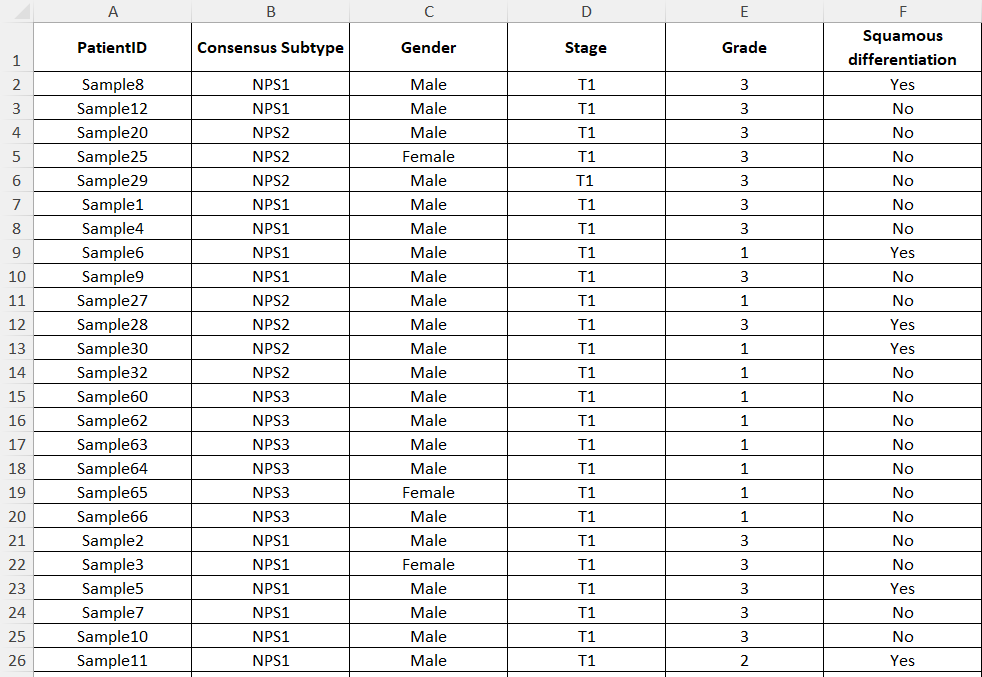

**Figure 1.** An example of the metadata file that can be inserted in
the *ProtE_analyse()* function. The first
column should contain the names of the samples, the second column
includes the experimental groups of comparison (for instance NPS1, NPS2,
NPS3) while the rest of the columns should include covariates that will
be taken into account for the limma statistical analysis (e.g. Gender,
Stage etc.).

Assuming a MaxQuant quantification has been performed, the file
ProteinGroups.txt (or ProteinGroups.xlsx) shall be inserted to
ProtE_analyse’s *file* parameter. To
copy-paste the file path in Windows, locate the desired file inside your
folders and right-click the file, then select "Copy as Path" from the
context menu. Go to RStudio and paste the path. Because usually the
directories will be separated with a single backlash, ensure to use
forward slashes (/) for specifying paths or adding a second backlash.

e.g:

    ProtE_analyse(file = "C:\\Bioprojects\\BreastCancer\\Proteomics\\MaxQuant\\ProteinGroups.txt")

or

    ProtE_analyse(file = "C:/Bioprojects/BreastCancer/Proteomics/MaxQuant/ProteinGroups.txt")

The same logic for the directory separators slashes applies when
inserting the *metadata_file* and
*pd_single_dir* parameters. If the user
provides a metadata file, the multiple files can be saved inside one
folder, who will be provided via the parameter
*pd_single_dir .*

e.g.:

    ProtE_analyse(file = "C:/Bioprojects/BreastCancer/Proteomics/MaxQuant/ProteinGroups.txt", 
     metadata_file = "C:/Bioprojects/BreastCancer/Proteomics/metadata.xlsx")

*ProtE_analyse()* detects the sample columns
in the proteome table automatically, either based on a key word or based
on the expected structure of the table. For ProteomeDiscoverer it
expects an Excel or .txt File generated by Proteome Discoverer (usually
from the .pdResult object) and detects sample columns based on their
column names, which must contain the word “Abundance”, or single files
per sample (usually from .msf Excel exports). For MaxQuant it accepts as
input the file proteinGroups.txt or proteinGroups.xlsx and detects
sample columns based on the columns with “Intensity” or “LFQ intensity”
(note the space character after the word Intensity, which is used to
differentiate the actual samples from the column named “Intensity”, the
latter containing the pooled intensity of all samples), while for DIA-NN
outputs it accepts either the unique_genes_matrix.tsv or the
pg_matrix.tsv files or the same tables converted to Excel file format,
and detects the sample columns based on the structure of the data.

**<u>Analysis when a metadata_file is not inserted:</u>**

For use cases 1-3 (Table 1) users need to rearrange the columns of their
proteome tables so that samples belonging to the same group are
positioned next to each other, as shown in **Figure 2**. Note that in
this case, the user should also fill the parameters
*group_names* and
*samples_per_group* .

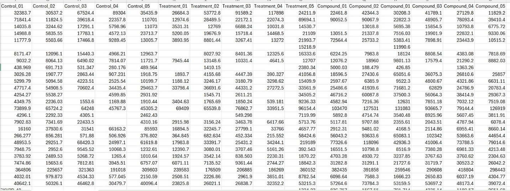

**Figure 2.** The order of the samples in the input tables should be
aligned with the group variables. Here we see 5 Control, then 5
Treatment, and 5 Compound samples.

*<u>Setting up the group_names and number of samples_per_group:</u>*

Assuming another imaginary cell line experiment, the proteome of 10
Control samples, 12 Treatment samples, and 9 Compound samples has been
quantified with MaxQuant.

Group names and the number of samples of each group are defined in the
parameters *group_names* and
*samples_per_group* respectively, and they are
both entered as vectors \[using the notation **c()**\]:

    ProtE_analyse(file = "C:\\Bioprojects\\BreastCancer\\Proteomics\\MaxQuant\\ProteinGroups.txt", 
                  group_names = c("Control", "Treatment", "Compound"), 
                  samples_per_group = c(10, 12, 9))

Note that *group_names* is a character vector
and henceforth its elements are written within apostrophes, while
*samples_per_group* is a numeric vector. The
order of the *group_names* inside the vector
must follow the order of the groups by which samples have been arranged
in the input proteome table. In the input table of this example, Control
samples have been arranged at the leftmost of the proteome table,
Treatment samples at the middle, and Compound samples at the rightmost.
Similarly to group_names, the order of the numbers in the
*samples_per_group* vector must follow the
ordering of the groups (10 Control, 12 Treatment, 9 Compound samples).

If ProteomeDiscoverer quantification was run *as batch*, multiple PD
export files (corresponding to individual samples) would be created. In
the absence of a metadata file, users will have to arrange the
ProteomeDiscoverer exports in distinct folders, based on the
experimental group they belong to. The folder names will be utilized as
the exact group names, thus renaming the folders appropriately before
feeding them to R, may be considered here. For example, assuming an
imaginary experiment in which samples are organized into three groups
(Control, Treatment, Compound), with each group containing 5 PD exports.
The Figure 3 below shows the structure of the directories/folders:

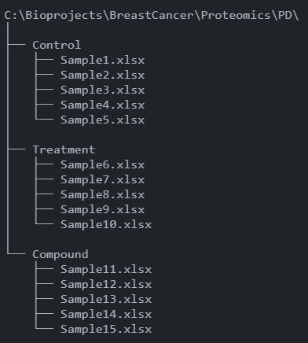

**Figure 3.** The structure of folders, directories, and Excel files
that can be input with *pd_multi*.

The input required in this case includes the file paths of the folders.
These are parsed into the function by separating the folder names either
with 2 backslashes (**\\**) or via a single forward slash (**/**):

    ProtE_analyse(pd_single_dir = c("C:\\Bioprojects\\BreastCancer\\Proteomics\\PD\\Control",
                                    "C:\\Bioprojects\\BreastCancer\\Proteomics\\PD\\Treatment",
                                    "C:\\Bioprojects\\BreastCancer\\Proteomics\\PD\\Compound"),
                  normalization = "cyclicLoess", imputation = FALSE)

**<u>Output directory:</u>**

The output files are created inside a folder named ProtE_analysis
followed by the date of the run and the numbers of run in that day,
which is in the last directory of the path of the input file that the
user has provided in the *file* or
*pd_single_dir* parameters. It contains 3
subfolders Data_processing, Statistical_analysis, and Plots (**Figure**
**4**).

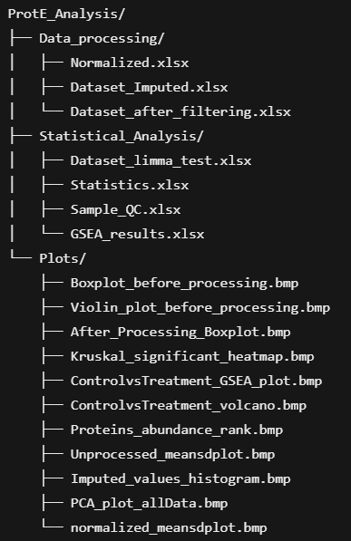

**Figure 4.** The output directories of ProtE analysis folder.

# **<u>ProtE pipeline</u>**

*ProtE_analyse()* follows a standardized
Proteomics analysis workflow, which is first processing of the data,
then proceeding to differential expression analysis and enrichment
analysis, while also producing quality check metrics and plots.

The data are processed via:

1.  **Annotation fetching** for the input files that do not include
    established Description.

2.  **Normalization** of proteomic intensity values

3.  **Filtering** based on the percentage of missing values of each
    protein.

4.  **Imputation** of missing data to ensure robust downstream analysis.

## **Description fetching**

If the descriptive information column is not available in the input
files, annotation information about the Protein IDs, is important to be
provided. For example, the input file .pg_matrix.tsv from DIA-NN usually
does not provide this information. Detailed data is obtained from the
UniProt database, using the *queryup* package. \[1\] The Description
information will be shown in all Excel files created that contain the
dataset and its statistics.

## **Normalization**

Mass Spectrometry quantitative data produced by software tools such as
Proteome Discoverer and MaxQuant may be required to be processed with
Normalization methods to reduce their systemic bias.\[2\] The ProtE
package offers different methods of normalization that are provided via
the `normalization` argument.

These options include a simple **log2 transformation** of the data
(`normalization = "log2"`), **Cyclic Loess normalization**
(`normalization = "Cyclic_Loess"`) that aims to reduce their
dissimilarities \[3\], and **Quantile normalization**
(`normalization = "Quantile"`) which is implemented to make the
distribution of each feature identical \[4\]. Both Quantile and Cyclic
loess Normalization are applied to the data **after their log2
transformation** and are implemented using functions of the *limma*
package \[5\].

The data can also be transformed with **median normalization**
(`normalization = "median"`), in which all intensity values are divided
by each sample’s median intensity, resulting in a median equal to 1
across the protein data set \[2\]. Other normalization methods share an
initial step of dividing each intensity value by the total sum of
intensities for its respective sample. **Total Ion Current
normalization** (`normalization = "TIC"`) then rescales the values by
multiplying them by the average Total Ion Current while **Parts Per
Million (PPM) normalization** (`normalization = "PPM"`) scales the
values by multiplying them by one million \[6\]. Lastly, **Variable
Stabilizing Normalization** (`normalization = "VSN"`)is also available
implementing the corresponding function of the *limma* package \[5\] .

Because the data output from DIA-NN has already been normalized with the
MaxLFQ quantification \[7\], any normalizing methods are suggested to be
applied **cautiously**, with the DIA-NN data. The same applies to
MaxQuant output that includes the already normalized data in LFQ
intensity columns.

| Normalization Method | Argument Value | Description | Notes |
|----|----|----|----|
| Log2 Transformation | `log2` | Applies a simple log2 transformation to the data. | Basic transformation, no additional steps. |
| Cyclic Loess Normalization | `Cyclic_Loess` | Reduces dissimilarities using Cyclic Loess normalization. | Applied after log2 transformation; uses `limma` package functions. |
| Quantile Normalization | `Quantile` | Makes the distribution of each feature identical. | Applied after log2 transformation; uses `limma` package functions. |
| Median Normalization | `median` | Divides intensity values by each sample’s median intensity (median = 1). | Ensures median intensity is 1 across the dataset. |
| Total Ion Current (TIC) | `TIC` | Divides intensities by total sum, rescales by average TIC. | To limit technical variability |
| Parts Per Million (PPM) | `PPM` | Divides intensities by total sum, scales by 1 million. | The dataset has significant intensities variability and needs a fixed scaling factor |
| Variable Stabilizing Normalization (VSN) | `VSN` | Applies Variable Stabilizing Normalization. | Uses `limma` package functions. |
| None (for DIA-NN/MaxQuant) | `FALSE` | No additional normalization (data already normalized). | Is the default method when `normalization` is undefined |

**Table 2.** Information about the normalization methods that can be
selected with function ProtE_analyse()

## **Filtering of Missing Values**

When working with mass spectrometry-based proteomics data, a common
issue encountered is the presence of missing values in the intensity
measurements for each protein. These missing values can occur for
several reasons. Some proteins may not be identified in the sample due
to technical limitations, their abundances may fall below the detection
limit of the analyzing instrument, or the proteins may be completely
absent from the examined sample. \[8\]

ProtE offers the option of filtering Proteins based on the percentage of
missing values they contain. Specifically, functions include the
argument `filtering_value`, which refers to the percentage of missing
values per protein allowed to remain in the filtered dataset. **Thus, if
the user sets it to 100, no filtering will occur, and the proteins will
not be altered.**

The parameter `global_filtering` determines if filtering for missing
values will be performed across all groups or separately inside each
group. When the intensity values of a protein contain only missing
values, they will be always omitted from the analysis. Also, the reverse
positive proteins (REV) will be excluded when the input is the
ProteinGroups.txt from MaxQuant.

## **Imputation**

The ProtE package also offers a few options for estimating the missing
values, via the argument `imputation` of each function.

The available imputation methods include simply assigning the **limit of
detection** (`imputation= "LOD"`) of the experiment (lowest abundance
value in the dataset), or **its half** (`imputation= "LOD/2"`)to the
missing values or **values derived from the Gaussian distribution of the
LOD** (`imputation= "Gaussian_LOD"`). Other options include treating
**missing values as zeros** (`imputation= "zeros"`) or **assigning the
mean abundance of each protein to its missing values**
(`imputation= "mean"`) , or **sampling from a Gaussian distribution
around the mean abundance**, (`imputation= "Gaussian_mean_sd"`)

The selected methods should be taken with respect to the nature of the
missing values in each dataset. \[9\]. Additionally, **k-nearest
neighbors (kNN)** (`imputation= "kNN"`) imputation is available from the
package VIM \[10\] and **missRanger** (`imputation= "missRanger"`), a
quicker multivariate imputation algorithm alternative to missForest
(based on random forests), from the package of the same name \[11\]. If
no imputation is selected, you set (`imputation= FALSE`).

| **Imputation Method** | **Argument Value** | **Description** | **Notes** |
|----|----|----|----|
| Limit of Detection (LOD) | `LOD` | Assigns the lowest abundance value in the dataset to missing values. | Reflects the experiment’s detection limit. |
| Half of Limit of Detection | `LOD/2` | Assigns half of the lowest abundance value to missing values. | A more conservative imputation than LOD. |
| Gaussian LOD | `Gaussian_LOD` | Assigns values derived from a Gaussian distribution of the LOD to missing values. | Introduces variability around the LOD. |
| Missing Values as Zeros | `zeros` | Treats missing values as zeros. | Assumes missingness indicates no detection. |
| Mean Abundance | `mean` | Assigns the mean abundance of each protein to its missing values. | Assumes missingness is random and uses protein mean. |
| Gaussian Mean and SD | `Gaussian_mean_sd` | Samples from a Gaussian distribution around the mean abundance of each protein. | Adds variability around the mean for missing values. |
| k-Nearest Neighbors (kNN) | `kNN` | Imputes missing values using the k-nearest neighbors algorithm. | Implemented via the `VIM` package \[10\]. |
| missRanger | `missRanger` | Uses a multivariate imputation algorithm based on random forests. | Faster alternative to missForest; uses `missRanger` package \[11\]. |
| No Imputation | `FALSE` | No imputation is applied to missing values. | Default if imputation is not desired. |

**Table 3.** Information about the imputation methods that can be
selected with function ProtE_analyse() The results of each data
processing step (e.g., the normalized then filtered, and finally imputed
dataset) are displayed in Excel files inside the Data_processing folder.
Note that the imputed data will have already been normalized.

# **<u>Statistical analysis</u>**

After the proteomics data are processed, ProtE functions perform
downstream statistical analysis and a variety of quality checks. The
analysis is conducted between the distinct groups and their samples.
Using the `independent` argument, the user can choose whether the group
variables should be analyzed as **independent** when
`independent = TRUE` (e.g. Control vs Patients) or as **matched** when
`independent = FALSE` (e.g. patients Before and After treatment, or cell
lines across different times of drug induction). In paired groups, the
number of samples in each one of them must be identical, and they should
be ordered.

The Excel file *traditional_statistics.xlsx* on the output folder
Statistical_analysis encapsulates non-parametrical and traditional
statistical tests’ results, alongside valuable information for each
gene. Specifically, it includes the average abundance and standard
deviation of every gene per group, along with the ratios and the
log2 fold changes of the averages between the groups.
Depending on the selection of either TRUE or FALSE for the `independent`
parameter, pairwise comparisons are conducted using the Mann-Whitney or
the Wilcoxon signed-rank test, while for more than two groups the
Kruskal Wallis or Friedman tests are also conducted. In the output, the
p-values and adjusted p-values, for these tests are also featured. The
user has the option of the p adjustment method that wants to be
implemented via the `p.adjust.method` parameter. Extra information
includes homoscedasticity checks for each gene with the Bartlett and
Levene tests p values being shown, as well as the multivariate pseudo-F
, R2 and p values from the PERMANOVA test, utilizing the
*adonis* test from vegan package \[12\].

Parametrical tests are performed utilizing the package *limma*, as it is
commonly used for differential expression analysis in large omics
datasets \[5,13\] and are saved in the Excel file
*limma_statistics.xlsx* . Specifically, the data undergoes
log2 transformation unless this step has already been
performed in the normalization process. A linear model is fitted using a
design matrix that includes the experimental groups and any covariates
(included in the metadata file), followed by Empirical Bayes moderation,
a standard approach in limma analyses. The model calculates coefficients
for each experimental group in the design matrix, which represents their
effects. When a `metadata_file` with covariates is provided, the
covariate coefficients are included in the output, and these covariates
are accounted for in the differential expression analysis. Additionally,
if the `independent` parameter is set to FALSE, subjects with repeated
measurements are treated as a random effect. An ANOVA-like F-test is
performed testing just the experimental groups of comparison, when they
are more than 2, while for every pairwise comparison a moderated t-test
is computed. The output includes p-values, adjusted p-values, t-scores,
and F-statistics from the Empirical Bayes moderated t-test and
ANOVA-like test, alongside the averages, and log2 fold
changes for each gene across groups (based on the limma-processed data)
and are presented in the Excel file.

The Excel file *Sample_QC.xlsx* contains information about the proteins
present in each sample and the missing values before and after
filtering. It also includes the scores of the first two principal
components for the entire dataset.

## **<u>Enrichment analysis</u>**

Finally, by utilizing the log2fold changes of the proteins of
each pairwise comparison, a fast Gene Set Enrichment analysis (GSEA) is
conducted, by implementing the package *fgsea* \[14\]. The user can
select via the `species` parameter, for which species the analysis will
be performed, and via the `subcollection` parameter from which
collection will the pathways/gene sets be used (e.g. REACTOME or GO
databases) . The results are saved inside an excel file named
GSEA_results.xlsx that contains the enriched pathways of each comparison
in different excel sheets.

**Information about each argument is available in the help file that you
can retrieve by writing `?ProtE_analyse` in your console.**

## **<u>Visualization plots</u>**

To complement the Excel files with the results of data processing and
the statistical analysis ProtE produces numerous plots, to interpret the
data and provide the user with credible information. Here we will
present examples of these plots that were created when we input jittered
data into the functions.

Firstly, a boxplot and violin plot alongside mean–standard deviation
plots are produced before and after the processing of the data. Thus,
they highlight the distribution and the variance of the values in each
sample as well as how they were affected by the normalization and the
imputation.

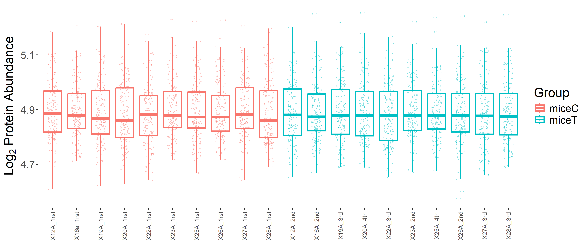

**Figure 5.** The boxplot of the data before (up) and after (down)
processing.

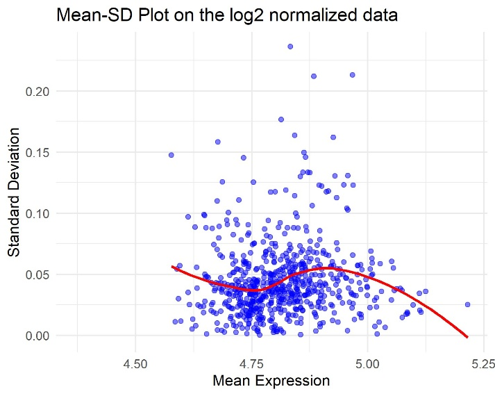
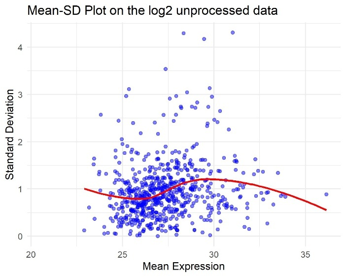

**Figure 6.** The mean sd plots before (up) and after (down) the
processing of proteomics data with *vsn* normalization and *missRanger*
imputation.

Additionally, a protein-ranked log2 abundance plot is
provided, which also shows the percentage of missing values for each
protein.

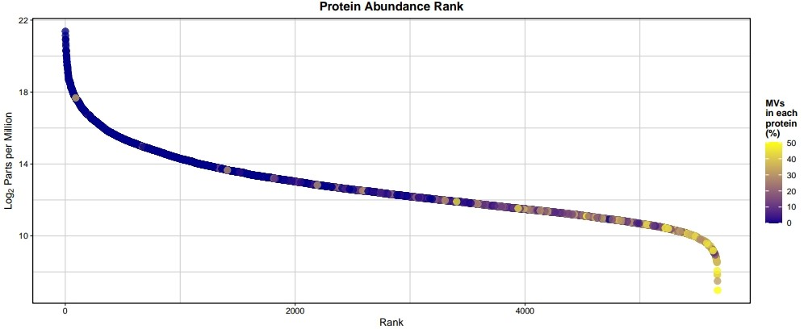

**Figure 7.** Protein Abundance Rank plot with information regarding the
percentage of MVs of each feature.

When imputation methods *mean*, *kNN*, *Gaussian_mean_sd*,
*Gaussian_LOD* and *missRanger* have been parsed, a histogram with the
distribution of the imputed values and the initial ones, is created to
inform the user about the imputation quality.

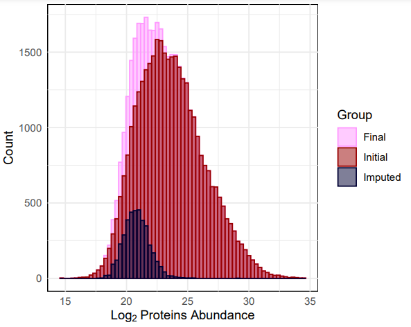

**Figure 8.** Histogram of the distribution of imputed values, available
for multiple values replacement options.

Users can select the statistical method for determining significance by
the logical setting `parametric` parameter. Setting `parametric = TRUE`
uses results from the limma t-test or ANOVA-like F-test , while
`parametric = FALSE` uses results from the Wilcoxon test or
Kruskal-Walli’s test. The user can further specify the significance
threshold with the `significance` argument: setting `significance = "p"`
uses a raw p-value threshold of 0.05, and `significance = "p.adj"` uses
the selector’s adjusted p-value threshold of 0.05.

A Coefficient of Variation (CoV) boxplot is also created, which
visualizes the distribution of per-protein variability (SD/mean × 100%)
across experimental groups, with each box representing a group’s median
CoV and interquartile range to assess reproducibility.

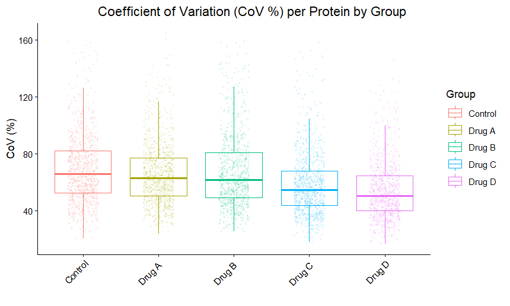

**Figure 9.** Coefficient of Variation plot across experimental groups

Principal Component Analysis (PCA) is also performed on the
log2-transformed protein abundance data for each sample. The data are
scaled and centered before the analysis. To visualize its results, a PCA
plot displaying all samples in a two-dimensional space where the axes
represent the first and the second principal components is created.

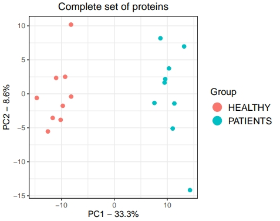
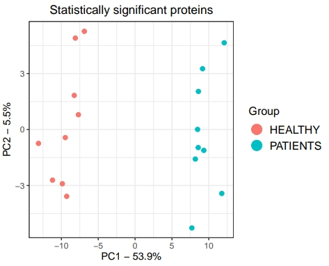

**Figure 10.** PCA plot derived from all the proteins (up) and the
significant ones (down)

For experiments with just 2 groups a heatmap is produced showing the
significant proteins of the selected test (via the `parametric`
argument).It is split into the selected groups and created with the
z-scale normalized abundances of each sample. In the heatmap clustering
of the proteins in rows takes place. When there are more than 2 groups,
one heatmap for the groups altogether is created by using the
significant proteins of the F-test or Kruskal-Walli’s/Friedman tests,
alongside a heatmap for each pairwise comparison.

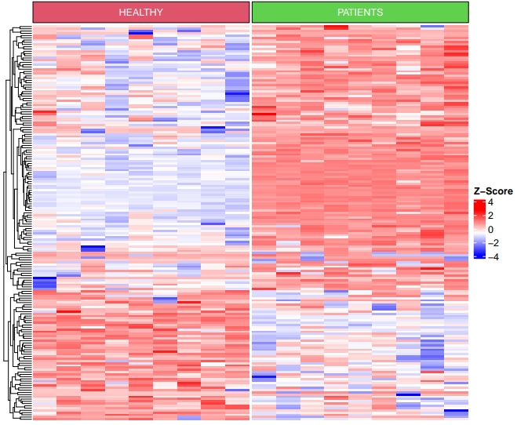

**Figure 11.** A heatmap for each pairwise comparison is created, while
clustering of the proteins in rows takes place.

Additionally, Volcano plots are also being created for every pairwise
comparison. With the `LFC` parameter the user can select the threshold
of the Log2Fold change from which the significant proteins
(either with p or adjusted p value \< 0.05) will be colored as up and
downregulated.

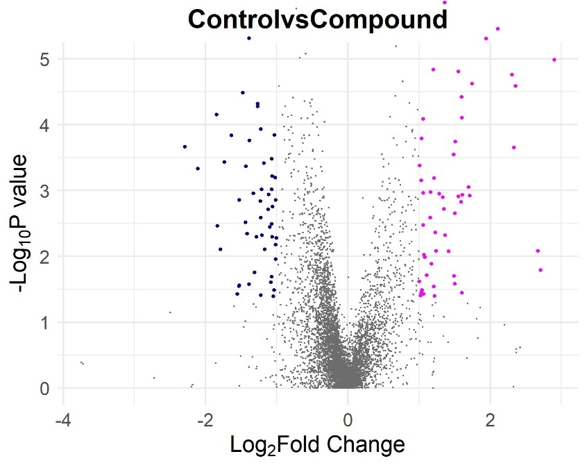

**Figure 12.** An example of a volcano plot that is created. In this
example, the p value is selected as the Y-axis instead of the adjusted p
value, and LFC threshold was set to 1.25.

Lastly, to visualize the results of the GSEA, enrichment plots are
created that showcase the significantly (p.adjusted \< 0.05)
down/upregulated gene sets between each comparison. The max number of
pathways/ gene sets in both up and downregulation are 7. If the
significant ones are more than 7, the 7 with the highest NES score are
selected.

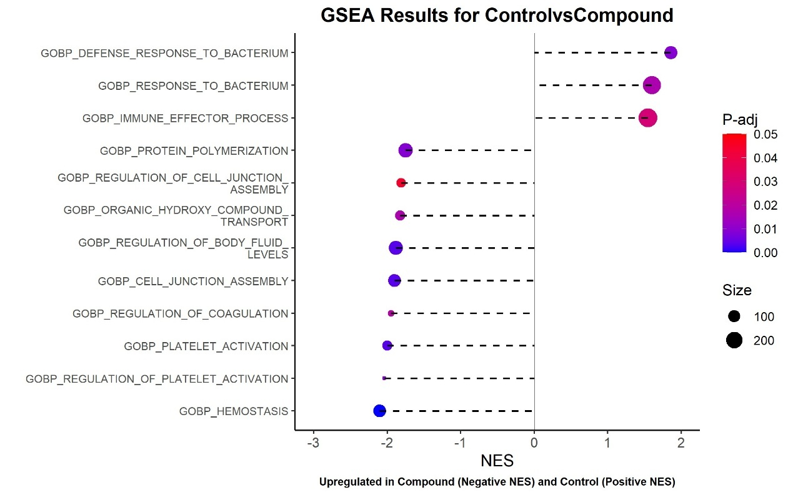

**Figure 13.** The enrichment plot showcasing the results of the GSEA.

All visualization plots are saved as BMP files and are inside the Plots
subfolder of the ProtE_analysis directory.

## **Example**

So if we want to run ProtE analyse with VSN normalization method ,
excluding proteins with more than 80 percent missing values in each
group of comparison, imputation method kNN, taking into account the
limma test for visualization plots, the BH adjustment pValue for
significance, the samples are from different mice and the gene sets are
from REACTOME database, we would run:

    ProtE_analyse(file = "C:/Bioprojects/BreastCancerMice/Proteomics/MaxQuant/ProteinGroups.txt", 
     metadata_file = "C:/Bioprojects/BreastCancerMice/Proteomics/metadata.xlsx", 
     normalization = "VSN", imputation = "kNN", filtering_value = 80, independent = TRUE, parametric = TRUE, 
     significance = "p.adj", species = "Mus musculus", subcollection =  "CP:REACTOME"
     )

# **References**

- \[1\] Voisinne G, queryup: Query the UniProt REST API using R. 2019.
  [CRAN](https://cran.r-project.org/web/packages/queryup/index.html)  
- \[2\] Välikangas, T., Suomi, T., Elo, L.L., A systematic evaluation of
  normalization methods in quantitative label-free proteomics. *Brief
  Bioinform* 2018, 19, 1–11. [DOI](https://doi.org/10.1093/bib/bbw095)  
- \[3\] Bolstad, B.M., Irizarry, R.A., Astrand, M., Speed, T.P., A
  comparison of normalization methods for high density oligonucleotide
  array data based on variance and bias. *Bioinformatics* 2003, 19,
  185–93. [DOI](https://doi.org/10.1093/bioinformatics/btg009)  
- \[4\] Zhao, Y., Wong, L., Goh, W.W. Bin, How to do quantile
  normalization correctly for gene expression data analyses. *Sci Rep*
  2020, 10, 15534. [DOI](https://doi.org/10.1038/s41598-020-72664-6)  
- \[5\] Ritchie, M.E., Phipson, B., Wu, D., Hu, Y., et al., limma powers
  differential expression analyses for RNA-sequencing and microarray
  studies. *Nucleic Acids Res* 2015, 43, e47.
  [DOI](https://doi.org/10.1093/nar/gkv007)  
- \[6\] Wulff, J.E., Mitchell, M.W., A Comparison of Various
  Normalization Methods for LC/MS Metabolomics Data. *Advances in
  Bioscience and Biotechnology* 2018, 09, 339–351.
  [DOI](https://doi.org/10.4236/abb.2018.98025)  
- \[7\] Cox, J., Hein, M.Y., Luber, C.A., Paron, I., et al., Accurate
  proteome-wide label-free quantification by delayed normalization and
  maximal peptide ratio extraction, termed MaxLFQ. *Mol Cell Proteomics*
  2014, 13, 2513–26. [DOI](https://doi.org/10.1074/mcp.M113.031591)  
- \[8\] Karpievitch, Y. V, Dabney, A.R., Smith, R.D., Normalization and
  missing value imputation for label-free LC-MS analysis. *BMC
  Bioinformatics* 2012, 13 Suppl 16, S5.
  [DOI](https://doi.org/10.1186/1471-2105-13-S16-S5)  
- \[9\] Harris, L., Fondrie, W.E., Oh, S., Noble, W.S., Evaluating
  Proteomics Imputation Methods with Improved Criteria. *J Proteome Res*
  2023, 22, 3427–3438.
  [DOI](https://doi.org/10.1021/acs.jproteome.3c00444)  
- \[10\] Kowarik, A., Templ, M., Imputation with the R Package VIM. *J
  Stat Softw* 2016, 74. [DOI](https://doi.org/10.18637/jss.v074.i07)  
- \[11\] Mayer M., missRanger: Fast imputation of missing values. R
  package version, 2(0). 2019.
  [CRAN](https://cran.r-project.org/web/packages/missRanger/index.html)  
- \[12\] Oksanen J,
  S.G.B.F.K.R.L.P.M.P.O.R.S.P.S.M.S.E.W.H.B.M.B.M.B.B.B.D.B.T.C.G.C.M.D.C.M.D.S.E.H.F.R.,
  vegan: Community Ecology Package. *R package version 2.7-0* 2024.
  [CRAN](https://cran.r-project.org/web/packages/vegan/index.html)  
- \[13\] Hutchings, C., Dawson, C.S., Krueger, T., Lilley, K.S.,
  Breckels, L.M., A Bioconductor workflow for processing, evaluating,
  and interpreting expression proteomics data. *F1000Res* 2023,
  12, 1402. [DOI](https://doi.org/10.12688/f1000research.139116.2)  
- \[14\] Korotkevich, G., Sukhov, V., Budin, N., Shpak, B., et al., Fast
  gene set enrichment analysis. *bioRxiv* 2016.
  [bioRxiv](https://doi.org/10.1101/060012)

## How to cite ProtE

To continue enriching and expanding the functionality of ProtE we kindly
request feedback from the users via contacting:
*<tmargelos@bioacademy.gr>*

In order to cite ProtE the following reference can be used:

Theodoros Margelos, Manousos Makridakis, Charis Gonidaki, et al. Simple,
fast, and reliable analysis of label-free proteomics data with the
Proteomics Eye (ProtE). Authorea. July 11, 2025.
[DOI](10.22541/au.175225896.65259586/v1)
