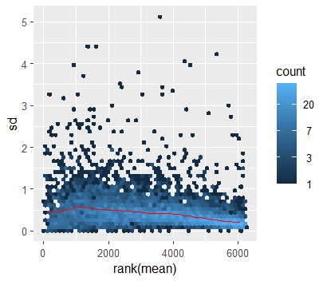

 
 

The workflow of these functions is identical, except for the specified changes, and proceeds as follows:


## Normalization

Firstly, the data can be processed via normalization, excluding the DIA-NN output, where MaxLFQ normalization has already been implemented. The different methods of normalization available as a parameter of the function include:

- Parts Per Million (PPM)
- Total Ion Current (TIC)
- Log2 transformation
- Quantile normalization
- Median normalization
- VSN normalization

The Normalized proteomics data are saved as `Normalized.xlsx` and they will be used in the downstream analysis.

Utilizing the package's "vsn" function `meanSdPlot` a plot with the standard deviation for each protein in the Y axis and their rank based on mean abundance in the X axis will be created.


```{r, echo=FALSE, fig.cap="**An example of the Standard deviation-Rank based on mean abundance plot.**"}
if (file.exists("sdmeanplot.jpeg")) {
   
} else if (file.exists("docs/articles/images/sdmeanplot.jpeg")) {
  knitr::include_graphics("docs/articles/images/sdmeanplot.jpeg")
} else {
  knitr::include_graphics(system.file("extdata/images/sdmeanplot.jpeg", package = "ProtE"))
}
```


## Filtering Missing Values

The data can be filtered based on the percentage of missing values per protein. Specifically:

- The parameter `threshold_value` refers to the percentage of missing values per protein allowed to remain in the filtered dataset.
- The parameter `global_filtering` determines if filtering for missing values will be performed across all groups (`TRUE`), or separately inside each group (`FALSE`). If set to FALSE, proteins passing the frequency threshold in only 1 of the groups, will remain in the data (maximum coverage).

## Description fetching
Because the output of DIA NN does not include any description of the proteins found, when using the function `dianno` the parameter `description` will be available. 
If the parameter `description` is set to `TRUE`, a new column named `description` with metadata will be included in the created Excel files. These metadata will be fetched using the UniProt.ws library, based on the first protein of the protein.Ids column in the .pg_matrix Excel file. This process requires internet access and will be utilized only when the input is the .pg_matrix.tsv and not unique_genes_matrix.tsv


## Imputation

Imputation of missing values is provided via the `Imputation` parameter. Options include:

- kNN
- MissRanger
- Limit of Detection (LOD)
- LOD/2

When using algorithm-induced imputation (e.g., kNN, MissRanger), an additional histogram showcasing the distribution of the imputed values is created (`imputed.pdf`):


```{r, echo=FALSE, fig.cap="**An example of the histogram of imputed values showing their distribution.**"}
if (file.exists("imputation_histogram.jpeg")) {
  knitr::include_graphics("imputation_histogram.jpeg") 
} else {
  knitr::include_graphics(system.file("extdata", "images/imputation_histogram.jpeg", package = "ProtE")) 
}
```


Additionally, a protein log2 abundance rank plot is created to provide information about the missing values for each protein:

```{r, echo=FALSE, fig.cap="**An example of the Protein Abundance Rank plot that will be created**"}
if (file.exists("prabrank.jpg")) {
  knitr::include_graphics("prabrank.jpg") 
} else {
  knitr::include_graphics(system.file("extdata", "images/prabrank.jpg", package = "ProtE")) 
}
```


## Statistical Analysis


Statistical analyses will then be performed, including pairwise comparisons between the groups. The parameter `sample_relationship` allows users to specify whether the group variables should be analyzed as independent or paired. By default, it is set to Independent, and to run as Paired, the user must provide groups with the same number of samples, with the order of the samples across them remaining the same.


The output includes an Excel file, `Statistical_analysis.xlsx`, which provides detailed information for each protein, including the average abundance, standard deviation, ratio, and log2 fold change of values between groups. It also includes the p-values and Benjamini–Hochberg adjusted p-values from pairwise Mann-Whitney comparisons, as well as Kruskal-Wallis test results when the number of groups is greater than 2. Additionally, the file contains in the columns "Bartlett_p" and "Levene_p" the p_values for the reported statistical tests, that examine the homoscedasticity of each proteins' abundances. Last but not least, the pValue and the pseudoF value from the multivariate PERMANOVA statistical test, utilizing the function adonis2 from the package vegan. 


Another Excel file, `limma_statistics.xlsx`, contains results from the parametric `limma` statistical test. This includes the ANOVA F-value, p-value, and adjusted p-value, as well as the B-statistic, unadjusted p-value, and Benjamini–Hochberg adjusted p-value for pairwise t-test comparisons between groups, as well as the ANOVA F-value, p-value, and adjusted p-value when the number of groups is greater than 2.

## Data visualization 

To visualize the distribution of data for each sample, a boxplot and violin plot are generated using the ggplot2 package. All protein abundance values are transformed via log2 transformation to ensure normality and comparability across samples. Sample names are displayed on the plots; however, if the names are too lengthy, only their last 25 characters will appear. To improve readability, it is recommended to use shorter sample names when possible. Additionally, the samples are colored according to their respective groups.


```{r, echo=FALSE, fig.cap="                                                **An example of the Boxplot that will be created with the protein abundance values for each sample.**"}
if (file.exists("Boxplot.jpeg")) {
  knitr::include_graphics("Boxplot.jpeg") 
} else {
  knitr::include_graphics(system.file("extdata", "images/Boxplot.jpeg", package = "ProtE")) 
}
```


```{r, echo=FALSE, fig.cap="                                                                                                                       **An example of the Violin plot that will be created with the protein abundance values for each sample.**"}
if (file.exists("ViolinPlot.jpeg")) {
  knitr::include_graphics("ViolinPlot.jpeg") 
} else {
  knitr::include_graphics(system.file("extdata", "images/ViolinPlot.jpeg", package = "ProtE")) 
}
```


Principal Component Analysis (PCA) is also performed on the log2-transformed protein abundance data for each sample. The data are scaled and centered prior to the analysis. A PCA plot is created, displaying the samples in a two-dimensional space where the axes represent the first two principal components.


```{r, echo=FALSE, fig.cap="**An example of the PCA plot that will be created with the 1st and 2nd Principal Components in each axis.**"}
if (file.exists("pcaplotall.jpeg")) {
  knitr::include_graphics("pcaplotall.jpeg") 
} else {
  knitr::include_graphics(system.file("extdata", "images/pcaplotall.jpeg", package = "ProtE")) 
}
```


An additional PCA plot is created using only the significant proteins identified during the statistical analysis. For pairwise comparisons between two groups, significant proteins are selected based on their statistical results from the comparison. When analyzing more than two groups, significant proteins are identified using analysis of variance (ANOVA) across all groups.

Users can select the statistical method for determining significance by setting the `parametric` parameter. Setting `parametric = TRUE` uses results from the limma t-test or ANOVA, while `parametric = FALSE` uses results from the Mann-Whitney U test or Kruskal-Wallis test. The user can further specify the significance threshold with the `significance` parameter: setting `significance = "pV"` uses a raw p-value threshold of 0.05, and `significance = "adj.pV"` uses the Benjamini-Hochberg adjusted p-value threshold.

A PCA plot is then generated based on the significant proteins:

```{r, echo=FALSE, fig.cap="**An example of the PCA plot that will be created taking into account the significant proteins.**"}
if (file.exists("pcaplotsig.jpeg")) {
  knitr::include_graphics("pcaplotsig.jpeg") 
} else {
  knitr::include_graphics(system.file("extdata", "images/pcaplotsig.jpeg", package = "ProtE")) 
}
```


Additionally, a heatmap of the significant proteins is generated using the ComplexHeatmap package. Proteins are clustered based on similarity in abundance patterns across groups, and the heatmap provides an overview of group-specific differences.

```{r, echo=FALSE, fig.cap="**An example of the heatmap that will be created taking into account the significant proteins.**"}
if (file.exists("heatmap.jpeg")) {
  knitr::include_graphics("heatmap.jpeg") 
} else {
  knitr::include_graphics(system.file("extdata", "images/heatmap.jpeg", package = "ProtE")) 
}
```


Lastly, an excel file names Quality_check.xlsx provides information about the percentage of missing values  before and after filtering, along with the scores of the first 2 principal components for each sample. 

